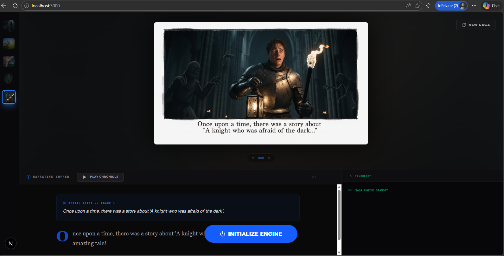
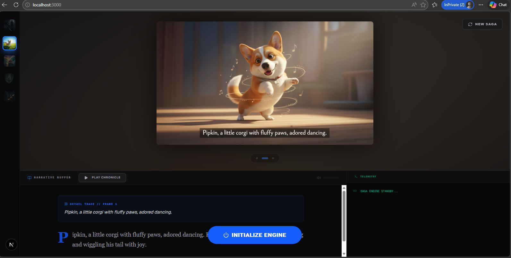

# Wonder  🗣️🎙️🎬🚀

A real-time, bi-directional (BIDI) AI agent powered by **Google ADK** and **Gemini Live API**.
A voice-driven AI pipeline that converts spoken ideas into structured cinematic storyboards in a single interface.

## 🏗 Architecture
- **Frontend:** Next.js 
- **Backend:** FastAPI on **Google Cloud Run**
- **AI Orchestration:** Google Agent Development Kit (ADK)
- **Storage:** Google Cloud Storage (GCS) for generated assets

## 🤖 Models used in Agents 

-	"imagen-4.0-fast-generate-001" is used to generate the main image or cover image for the story. 
-	“gemini-2.5-flash-image”, Nano Banana was used to generate the subsequent images with interleaved output. 
-	“gemini-2.5-flash-preview-tts” was used to generate the audio narration. 
-	“veo-3.1-fast-generate-001” has also been used in testing to create video generation from the main image. 


## 🛠 Setup & Installation

Vlone the github repository
cd your-repo-name

### Backend
1. `cd adk-streaming/app/google_search_agent`
2. `pip install -r requirements.txt`
3. `uvicorn main:app --reload`

## Frontend
1. `cd my-agent-ui`
2. `npm install`
3. `npm run dev`

## 🔑 Environment Configuration

You will need to set up `.env` files in both the root of the `/backend` and `/agent-ui` folders.

### Backend (`/google_search_agent/.env`)
```env
GOOGLE_API_KEY=your_gemini_api_key
GCP_PROJECT_ID=your_project_id
GCS_BUCKET_NAME=your_assets_bucket_name


### 🔑 Frontend Environment Configuration

You will need to set up `.env` files in both the root of the `/backend` and `/my-agent-ui` folders.

### Frontend (`/my-agent-ui/.env`)
```env
GOOGLE_CLOUD_PROJECT= "your_poject_id"
GOOGLE_CLOUD_LOCATION="your_location"
GCS_BUCKET_NAME="your_assets_bucket_name"
GOOGLE_APPLICATION_CREDENTIALS = "/secrets/key.json"
```

## ☁️Deployment

This project is configured for **Google Cloud Platform**.
- Backend runs on **Cloud Run** with a WebSocket enabled entry point.
- Assets are persisted in a **GCS Bucket**.
- Deployment automated with Dockerfile - gcloud run deploy project-name --source . --region your-region --allow-unauthenticated --set-env-vars="PYTHONNUNBUFFERED =1, GOOGLE_GENAI_USE_VERTEXAI = TRUE"

## Screenshots 






